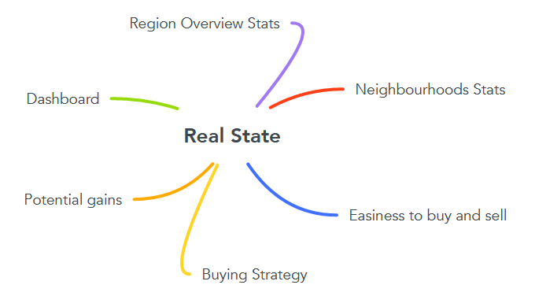

[**House Sales in King County, USA** by Fulvio](index.html)

# Insights on real estate for purchase and resale

This project was carried out using data available on the
[kaggle](https://www.kaggle.com/datasets/harlfoxem/housesalesprediction)
website. The objective is to identify good deals on properties for
purchase with subsequent profit.

The dataset comprehends house sales prices for King County, Seattle,
USA. It includes homes sold between May 2014 and May 2015.

If you want to jump right to the HEROKU dashboard with suggestions for
deals, [please click here](https://house-analysis-dashboard.herokuapp.com/).

You can also check the Jupyther notebook for the project [here](https://github.com/fusaa/house-dashboard).

The Insight Analysis was conducted in order to answer the question for
potential investors, which houses should be bought and for what value
they should be sold.

It was done in Python using libraries like Pandas, Numpy, Streamlit,
Folium, Seaborn. Also a dashboard to Heroku was deployed.

### The objective

From the point of view of making an investment in a property thinking
about resell value with little knowlodge of the local market it was
developed a dashboard with a few insights to help the decision making
proccess.

### The methodology

Using the available database, it was done an exploratory analysis on the
data, in order to identify a good strategy for reselling.

The data provided only one year of transactions, which made the
analysis more limited. However it was still possible to generate
interisting insights on the data.

  
### Data

Available data can be described according to the following table:

| Name         | Description                                    |
| ------------ | ---------------------------------------------- |
| id           | Unique ID for each transaction.                |
| date         | Transaction Date.                              |
| price        | Transaction ammount.                           |
| bedrooms     | Number of bedrooms.                            |
| bathrooms    | Number of bathrooms. '.5' accounts for toilet. |
| sqft\_living | Square footage living area.                    |
| sqft\_lot    | Lot size.                                      |
| floors       | Number of pavements.                           |
| waterfront   | Means house has a view to waterfront.          |
| view         | Score 1-4 on how good view is.                 |

| Name           | Description                                                                              |
| -------------- | ---------------------------------------------------------------------------------------- |
| grade          | Score on building construction and design. Eg 7 is average level, the higher the better. |
| sqft\_above    | House interior area above ground level.                                                  |
| yr\_build      | Year house was built.                                                                    |
| yr\_renovated  | When house was renovated.                                                                |
| zipcode        | Zipcode.                                                                                 |
| lat            | Property latitude.                                                                       |
| lon            | Property lontitude.                                                                      |
| sqft\_living15 | Size in square foot of the nearest 15 neighbors.                                         |
| sqft\_lot15    | Size of the land of the nearest 15 neighbors.                                            |
| bathrooms      | Number of bathrooms.                                                                     |

### During the data explorarion a few hypothesis were generated:
  1) The square foot of newer houses are more expensive:
  Not true, they tend to be cheaper. The graph shows that properties that was a decline in price in the 50s and it has been kept from 60s onwards.
  2) Cheaper properties are easier to resell.
  It is true, the properties that sell the most are the ones between 300.000 and 400.000 dollars. Moreover the properties between 200.000 and 600.000 account for over 67% of the transactions.
  3) The larger the property(living area) the cheaper the square foot:
  That would be true in relative terms. If considered the properties only with a size up to 2.500 sqft, beyond that values will get higher. So the statement must be rejected.
  4) The larger the property + lot size, the cheaper the square foot:
  To answer this the dataset has been sliced in 20.000 sqft increaments for the computated area, according to the graph and the presence of outliers this hypothesis has become unconclusive. So can´t be validated using the whole of the dataset.
  5) During certain quarters of the year prices are higher:
  The dataset comprehends only one year, so it makes it hard to come to a conclusion. Worth mentioning the graph for the specific period the data is available shows no significant difference between quarters.
  6) Regions where the renovation rate is higher tend to have a higher price.
  Calculating the median price for each specific zipcode and comparing the renovation-rate(which takes in account the percentage of properties transactioned in the period that had been renovated) it is safe to assume that a neighbourhood that has higher renovation rates will have higher prices. The correlation result of 0.66 clearly shows that. Hypothesis accepted.
  
  
  
  7) Regions where the renovation rate is higher tend to have a higher price.
  
  8) Properties older than 10y and built from the 30s onwards sell for higher if they had renovation done:
  Houses built after 1945 all tend to sell higher if they had renovation done, however when looking at houses built before that somehow wouldn´t be case. This hypothesis can be accepted.
  
 ##  Multivariate analysis
  Checking the multivariate analysis there are a few interesting correlations noticed, prices strongly correlates to areas of the construction (sqft_living, sqft_above, sqft_basement), as well to the construction area of the surrounding properties(sqf_living15), which makes sense.

Waterfront properties tend to have a high view rating, as well as the number of bedrooms, bathrooms, floors and grade have all strongly relates to each other

